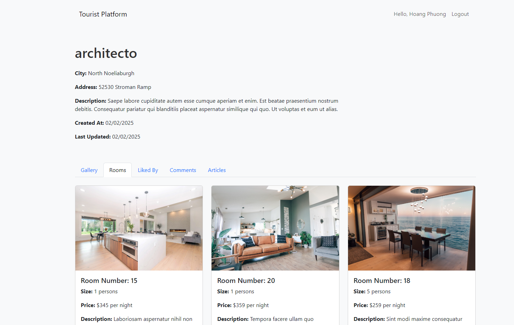

# Reservation System

## Project Overview

The Reservation System is a web application designed to manage and display information about tourist spots. It includes features such as showing detailed information about each tourist spot, displaying a gallery of images, listing available rooms, and showing users who have liked each spot.

### Key Features

- Display detailed information about tourist spots.
- Show a gallery of images for each tourist spot.
- List rooms available at each tourist spot with their details.
- Display users who have liked each tourist spot.
- Responsive design using Bootstrap 5.

## Project Branches

### 1. Main Branch

The main branch contains the core functionality of the application, including displaying tourist spots and their details.

### 2. Detail-Tourist-Spot Branch

The detail-tourist-spot branch includes enhancements to display detailed information about each tourist spot, including room details and a list of users who have liked the spot.

## Technologies Used

- **Backend:** Laravel
- **Frontend:** Bootstrap 5
- **Database:** MySQL
- **Other:** JavaScript, HTML/CSS

## How to Contribute

If you are interested in contributing to this project or have any suggestions, feel free to fork the repository and create pull requests.

## Contact

For any questions or further information, please contact:

- **Name:** [Ngueyn Trinh Hoang Phuong]
- **Email:** [nguyentrinhhoangphuong@gmail.com]

